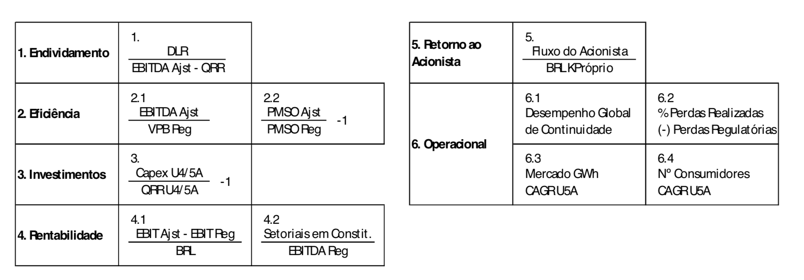
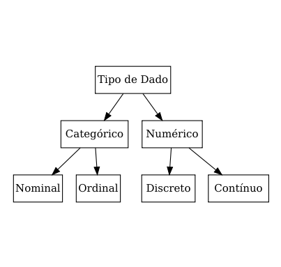

read\_aneel
================

Análise exploratória da BD do relatório de indicadores de
=========================================================

sustentatibilidade econômico-financeiros - ANEEL

Dada a necessidade de sistematização do monitoramento econômico-financeiro, a ANEEL compila uma base de dados com variáveis financeiras e operacionais das empresas distribuidoras de energia elétrica. As bases estão presentes em cinco arquivos .xlsx e apresentam dados anuais para cada empresa até 2016 e trimestrais desde então. Embora a base de dados tenha um grande número de variáveis disponíveis, os principais indicadores foram selecionados na 5ª Edição do Relatório de Indicadores de Sustentabilidade Econômico-Financeira das Distribuidoras (pg 28):



Análise de consistência
-----------------------

O banco de dados ou base de dados (BD) é uma coleção organizada de dados que se relacionam de forma a criar alguma informação, capaz de direcionar pesquisas, estudos e tomadas de decisão. O modelo (plano) de BD adotado pela ANEEL consiste de matrizes bidimensionais que são a base para as planilhas eletrônicas, compostas por células de caracteres, inteiros ou números reais.

A verificação de consistência é uma avaliação realizada para indicar se a BD apresenta algum conflito interno ou incoerência. Nesse sentido, esta seção tem como objetivo averiguar a qualidade dos dados e relatar problemas ou erros no conjunto de dados fornecidas pela ANEEL.

### Repetição de Atributos (Colunas)

A repetição na nomenclatura dos atributos foi um grave problema encontrado nas cinco bases de dados dos Relatórios de Sustentabilidade, no arquivo de número 5 (A5), por exemplo, há dois atributos **DGC**. Posto que não há singularidade, esse tipo de conflito impossibilita a manutenção da desiginação original, consequentemente, a importação dos dados feita com *data loaders* (eg.: 'read\_xlsx') dos principais pacotes estatísticos automaticamente altera o identificador para **DGC** e **DGC\_1**.

A tabela de frequência do Apêndice A apresenta todos os atributos conflitantes, já a Tabela 1 exibe os 11 indicadores selecionados na seção IV (p. 28). Note que uma BD consistente exibiria frequência 1 em cada arquivo e um total de 5, as siglas **A1**-**A5** referem-se aos arquivos.

<table style="width:90%;">
<caption>Tabela 1: <strong>A1</strong>:Indicadores Base 2017 1T 2017 08 07.xlsx, <strong>A2</strong>: Indicadores Base 2017 2T 2017 11 10.xlsx, <strong>A3</strong>: Indicadores Base 2017 3T 2018 02 20.xlsx, <strong>A4</strong>: Indicadores Base 2018 1T 2018 08 06.xlsx e <strong>A5</strong>: Indicadores Base 2018 1T 2018 08 06.xlsx.</caption>
<colgroup>
<col width="45%" />
<col width="6%" />
<col width="6%" />
<col width="6%" />
<col width="6%" />
<col width="6%" />
<col width="9%" />
</colgroup>
<thead>
<tr class="header">
<th align="center"> </th>
<th align="center">A1</th>
<th align="center">A2</th>
<th align="center">A3</th>
<th align="center">A4</th>
<th align="center">A5</th>
<th align="center">Total</th>
</tr>
</thead>
<tbody>
<tr class="odd">
<td align="center"><strong>DLR / EBITDA - QRR</strong></td>
<td align="center">1</td>
<td align="center">1</td>
<td align="center">1</td>
<td align="center">1</td>
<td align="center">1</td>
<td align="center">5</td>
</tr>
<tr class="even">
<td align="center"><strong>EBITDA Ajst / VPB Reg</strong></td>
<td align="center">1</td>
<td align="center">1</td>
<td align="center">1</td>
<td align="center">1</td>
<td align="center">1</td>
<td align="center">5</td>
</tr>
<tr class="odd">
<td align="center"><strong>PMSO Ajustado / PMSO Regulatório</strong></td>
<td align="center">1</td>
<td align="center">1</td>
<td align="center">1</td>
<td align="center">1</td>
<td align="center">1</td>
<td align="center">5</td>
</tr>
<tr class="even">
<td align="center"><strong>Capex U4/5A</strong></td>
<td align="center">1</td>
<td align="center">1</td>
<td align="center">1</td>
<td align="center">1</td>
<td align="center">1</td>
<td align="center">5</td>
</tr>
<tr class="odd">
<td align="center"><strong>QRR U4/5A</strong></td>
<td align="center">2</td>
<td align="center">2</td>
<td align="center">2</td>
<td align="center">2</td>
<td align="center">2</td>
<td align="center">10</td>
</tr>
<tr class="even">
<td align="center"><strong>EBIT Ajst - EBIT Reg / BRL</strong></td>
<td align="center">1</td>
<td align="center">1</td>
<td align="center">1</td>
<td align="center">1</td>
<td align="center">1</td>
<td align="center">5</td>
</tr>
<tr class="odd">
<td align="center"><strong>Setoriais Constituição / EBITDA Reg</strong></td>
<td align="center">1</td>
<td align="center">1</td>
<td align="center">1</td>
<td align="center">1</td>
<td align="center">1</td>
<td align="center">5</td>
</tr>
<tr class="even">
<td align="center"><strong>Fluxo Acionista / (BRL x Cap Próprio)</strong></td>
<td align="center">1</td>
<td align="center">1</td>
<td align="center">1</td>
<td align="center">1</td>
<td align="center">1</td>
<td align="center">5</td>
</tr>
<tr class="odd">
<td align="center"><strong>DGC</strong></td>
<td align="center">2</td>
<td align="center">2</td>
<td align="center">2</td>
<td align="center">2</td>
<td align="center">2</td>
<td align="center">10</td>
</tr>
<tr class="even">
<td align="center"><strong>Perdas Realizadas</strong></td>
<td align="center">1</td>
<td align="center">1</td>
<td align="center">1</td>
<td align="center">1</td>
<td align="center">1</td>
<td align="center">5</td>
</tr>
<tr class="odd">
<td align="center"><strong>Perdas Regulatórias</strong></td>
<td align="center">1</td>
<td align="center">1</td>
<td align="center">1</td>
<td align="center">1</td>
<td align="center">1</td>
<td align="center">5</td>
</tr>
<tr class="even">
<td align="center"><strong>Mercado CAGR U5A</strong></td>
<td align="center">2</td>
<td align="center">2</td>
<td align="center">2</td>
<td align="center">2</td>
<td align="center">2</td>
<td align="center">10</td>
</tr>
<tr class="odd">
<td align="center"><strong>Nº CAGR U5A</strong></td>
<td align="center">1</td>
<td align="center">1</td>
<td align="center">1</td>
<td align="center">1</td>
<td align="center">1</td>
<td align="center">5</td>
</tr>
</tbody>
</table>

### Tipos de Dado

O tipo de variável é um conceito primordial para aplicação correta de técnicas estatíticas. Há dois tipos de dado o quantitativo ou numérico que resulta de uma mensuração (e.g.: estatura, peso) e o dado qualitativo ou categórico que registra qualidades descritivas ou subjetivas, podem representar grupos ou características (e.g.: sexo) e podem assumir valores numéricos (e.g.: 1 para mulheres e 0 para homens), observe que uma varivel categórica não têm significado matemático.



Os indicadores selecionados são provenientes da combinação de atributos de natureza numérica. No entanto, variáveis qualitativas foram consideradas em campos de natureza quantitativa com objetivo de sinalizar situações adversas inerentes ao cálculo desses indicadores. Ou seja, além de valores inteiros e reais, encontram-se células com caracteres, o que configura outra inconsistência na BD. No Apêndice B segue a interpretação para cada valor usado, segundo o Glossário (p. 27) da 5ª Edição do Relatório.

|                                       | Cxa Líq | Ebitda Neg | Flx Neg | nd   | 0 / + | - / + |
|---------------------------------------|---------|------------|---------|------|-------|-------|
| DLR / EBITDA - QRR                    | 233     | 303        | 203     | 12   | -     | -     |
| Setoriais Constituição / EBITDA Reg   | -       | -          | -       | 2093 | -     | -     |
| Fluxo Acionista / (BRL x Cap Próprio) | -       | -          | -       | -    | 394   | 317   |
| DGC                                   | -       | -          | -       | 443  | -     | -     |
| Perdas Realizadas                     | -       | -          | -       | 443  | -     | -     |
| Perdas Regulatórias                   | -       | -          | -       | 443  | -     | -     |
| Nº CAGR U5A                           | -       | -          | -       | 58   | -     | -     |

Isto posto, foi feita a verificação do cálculo dos indicadores no intuito de desvendar os valores correspondentes à "Cxa Líq", "Flx Neg", "Ebitda Neg", nd", "0 / +" e "- / +". Surpreendentemente, regressamos ao problema inicial de colunas repetidas, porém, desta vez com relação aos valores que geram os indicadores selecionados, além disso, descobrimos que há atributos de mesmo nome com valores distintos. Por exemplo, no arquivo **A5** as colunas **EBITDA Ajst** e **EBITDA Ajst\_1** diferem 576 vezes (Apêndice C).

<table style="width:40%;">
<colgroup>
<col width="19%" />
<col width="20%" />
</colgroup>
<thead>
<tr class="header">
<th align="center">EBITDA Ajst</th>
<th align="center">EBITDA Ajst_1</th>
</tr>
</thead>
<tbody>
<tr class="odd">
<td align="center">-1281225</td>
<td align="center">-1291273</td>
</tr>
<tr class="even">
<td align="center">-5075946</td>
<td align="center">-5080589</td>
</tr>
<tr class="odd">
<td align="center">-225468</td>
<td align="center">-1270288</td>
</tr>
<tr class="even">
<td align="center">408186</td>
<td align="center">758512</td>
</tr>
<tr class="odd">
<td align="center">395766</td>
<td align="center">395614</td>
</tr>
<tr class="even">
<td align="center">208660</td>
<td align="center">408996</td>
</tr>
</tbody>
</table>

### Princípio da Unicidade

Nesta seção foi abordado o princípio da unicidade baseado em chaves primárias de um sitema de BD relacional. Apesar de não haver estruturação ou relações no plano de BD usado esse conceito proporciona a identificacão de cada item armazenado nas tuplas (linhas) de modo singular. O conceito de chaves primárias refere-se ao campo cujos valores podem ser usadas como um índice de referência, logo, uma chave primária não pode ter valor nulo ou repetição. Na BD, esse indicador único é a variável 'Referência' composta pela combinação de 'Distribuição' e 'Período'. Porém, no exemplo a seguir observamos a violação desse princípio.

<table>
<colgroup>
<col width="22%" />
<col width="44%" />
<col width="33%" />
</colgroup>
<thead>
<tr class="header">
<th align="center">Referência</th>
<th align="center">Arquivo</th>
<th align="center">Mercado CAGR U5A</th>
</tr>
</thead>
<tbody>
<tr class="odd">
<td align="center">Cemig-D201703</td>
<td align="center">./data//Indicadores Base 2017 1T 2017 08 07.xlsx</td>
<td align="center">nd</td>
</tr>
<tr class="even">
<td align="center">Cemig-D201703</td>
<td align="center">./data//Indicadores Base 2018 1T 2018 08 06.xlsx</td>
<td align="center">-8.3385206834377668E-3</td>
</tr>
</tbody>
</table>

### Conclusão

Ao longo do relatório foi possível identificar ao menos três grandes incoerências na BD que podem ser controladas com a implantação de um BD relacional em um Sitema de Gerenciamento de Banco de Dados (SGBD). Bases de dados relacionais consistem, principalmente de três componentes uma coleção de estruturas de dados, conhecidas como relações (tabelas), operadores relacionais e restrições de integridade, definindo o conjunto consistente de estados de base de dados, bem como de alterações desses estados. O SGBD talvez seja mais útil para fornecer uma visão centralizada de dados que podem ser acessados por vários usuários, de vários locais, de maneira controlada. Os SGBD de dados são o método preferido de armazenamento, recuperação de dados e informações para aplicações multiusuárias.

Análise descritiva
------------------

Prosseguiremos agora para a análise descritiva da BD. Numa tentativa de contornar os problemas previamente citados, assumimos algumas premissas:

-   Os dados mais recentes são mais confiáveis e serão utilizados quando houver valores repetidos para uma determinada entrada no BD.
-   Quando o valor não estiver disponível (NA) na base mais recente, a última entrada válida será considerada.
-   A primeira coluna com um determinado nome de variável será selecionada.

Foi feito o estudo descritivo dos indicadores **1**, **2.1**, **2.2**, **4.1**, **4.2**, **5**, **6.2**, **6.4** com base em 9 atributos inicialmente consistentes.

-   1.) DLR / EBITDA - QRR

-   2.1) EBITDA Ajst / VPB Reg

-   2.2) PMSO Ajustado / PMSO Regulatório

-   4.1) EBIT Ajst - EBIT Reg / BRL

-   4.2) Setoriais Constituição / EBITDA Reg

-   5.) Fluxo Acionista / (BRL x Cap Próprio)

-   6.2) Perdas Realizadas

-   6.2) Perdas Regulatórias

-   6.4) Nº CAGR U5A

------------------------------------------------------------------------

``` r
library(dplyr)
library(ggplot2)

dt <- read.csv("dados_last_not_na.csv")

dt_sel <- dt %>% 
  select(dlr_ebitda_ajst_qrr, ebitda_ajst_vpb_reg, pmso_ajustado_pmso_regulatorio,
         capex_u4_5a, ebit_ajst_ebit_reg_brl, setoriais_constituicao_ebitda_reg,
         fluxo_acionista_brl_x_cap_proprio, dgc, perdas_realizadas, perdas_regulatorias,
         mercado_cagr_u5a, n_cagr_u5a) %>% 
  mutate(dlr_ebitda_ajst_qrr = as.numeric(replace(dlr_ebitda_ajst_qrr, 
                                                  dlr_ebitda_ajst_qrr 
                                                  %in% c("Ebitda Neg", "Flx Neg", 
                                                         "Cxa Líq"), NA))) %>% 
  mutate(fluxo_acionista_brl_x_cap_proprio = as.numeric(replace(fluxo_acionista_brl_x_cap_proprio,
                                                                fluxo_acionista_brl_x_cap_proprio 
                                                                %in% c("0 / +", "- / +"), NA)))
```

A base de dados apresenta as 11 variáveis selecionadas no documento da ANEEL. As variáveis perdas realizadas e perdas regulatórias presentes no indicador 6.2 são apresentadas como duas variáveis separadas. As variáveis apresentam um grande número de valores faltantes, como mostrado na tabela abaixo.

> Adicionar gráfico de faltantes.

### Endividamento

``` r
ggplot(dt_sel, aes(dlr_ebitda_ajst_qrr)) +
  geom_histogram(bins = 10, na.rm = T, fill = "lightblue", color = "white") +
  labs(x = "Endividamento", y = "Frequência") +
  theme_light()
```


### Eficiência

``` r
ggplot(dt_sel, aes(ebitda_ajst_vpb_reg)) +
  geom_histogram(bins = 10, na.rm = T, fill = "lightblue", color = "white") +
  labs(x = "Eficiência (2.1)", y = "Frequência") +
  theme_light()
```


``` r
ggplot(dt_sel, aes(pmso_ajustado_pmso_regulatorio)) +
  geom_histogram(bins = 10, na.rm = T, fill = "lightblue", color = "white") +
  labs(x = "Eficiência (2.2)", y = "Frequência") +
  theme_light()
```


### Investimentos

``` r
ggplot(dt_sel, aes(capex_u4_5a)) +
  geom_histogram(bins = 10, na.rm = T, fill = "lightblue", color = "white") +
  labs(x = "Investimetos", y = "Frequência") +
  theme_light()
```


### Rentabilidade

``` r
ggplot(dt_sel, aes(ebit_ajst_ebit_reg_brl)) +
  geom_histogram(bins = 10, na.rm = T, fill = "lightblue", color = "white") +
  labs(x = "Rentabilidade (4.1)", y = "Frequência") +
  theme_light()
```


``` r
ggplot(dt_sel, aes(setoriais_constituicao_ebitda_reg)) +
  geom_histogram(bins = 10, na.rm = T, fill = "lightblue", color = "white") +
  labs(x = "Rentabilidade (4.2)", y = "Frequência") +
  theme_light()
```


### Retorno ao acionista

``` r
ggplot(dt_sel, aes(fluxo_acionista_brl_x_cap_proprio)) +
  geom_histogram(bins = 10, na.rm = T, fill = "lightblue", color = "white") +
  labs(x = "Retorno ao acionista", y = "Frequência") +
  theme_light()
```


### Operacional

``` r
ggplot(dt_sel, aes(dgc)) +
  geom_histogram(bins = 10, na.rm = T, fill = "lightblue", color = "white") +
  labs(x = "Operacional (6.1)", y = "Frequência") +
  theme_light()
```


``` r
ggplot(dt_sel, aes(perdas_realizadas)) +
  geom_histogram(bins = 10, na.rm = T, fill = "lightblue", color = "white") +
  labs(x = "Operacional (6.2.1)", y = "Frequência") +
  theme_light()
```


``` r
ggplot(dt_sel, aes(perdas_regulatorias)) +
  geom_histogram(bins = 10, na.rm = T, fill = "lightblue", color = "white") +
  labs(x = "Operacional (6.2.2)", y = "Frequência") +
  theme_light()
```


``` r
ggplot(dt_sel, aes(mercado_cagr_u5a)) +
  geom_histogram(bins = 10, na.rm = T, fill = "lightblue", color = "white") +
  labs(x = "Operacional (6.3)", y = "Frequência") +
  theme_light()
```


``` r
ggplot(dt_sel, aes(n_cagr_u5a)) +
  geom_histogram(bins = 10, na.rm = T, fill = "lightblue", color = "white") +
  labs(x = "Operacional (6.4)", y = "Frequência") +
  theme_light()
```


### Correlograma

``` r
cor_matrix <- cor(dt_sel, use = "complete.obs")
colnames(cor_matrix) <- c("endiv", "efic 2.1", "efic 2.2", "invest", "renta 4.1",
                          "renta 4.2.", "acion", "opera 6.1", "opera 6.2.1",
                          "opera 6.2.2", "opera 6.3", "opera 6.4")
rownames(cor_matrix) <- c("endiv", "efic 2.1", "efic 2.2", "invest", "renta 4.1",
                          "renta 4.2.", "acion", "opera 6.1", "opera 6.2.1",
                          "opera 6.2.2", "opera 6.3", "opera 6.4")

ord <- order(cor_matrix[1,])
xc <- cor_matrix[ord, ord]

ellipse::plotcorr(xc, col=cm.colors(12)[5*xc + 6], type = "lower", diag = TRUE)
```


### Séries temporais para a cemig

``` r
dt_cemig <- dt %>% 
  select(dlr_ebitda_ajst_qrr, ebitda_ajst_vpb_reg, pmso_ajustado_pmso_regulatorio,
         capex_u4_5a, ebit_ajst_ebit_reg_brl, setoriais_constituicao_ebitda_reg,
         fluxo_acionista_brl_x_cap_proprio, dgc, perdas_realizadas, perdas_regulatorias,
         mercado_cagr_u5a, n_cagr_u5a, distribuidora_r_mil, periodo) %>% 
  mutate(dlr_ebitda_ajst_qrr = as.numeric(replace(dlr_ebitda_ajst_qrr, 
                                                  dlr_ebitda_ajst_qrr 
                                                  %in% c("Ebitda Neg", "Flx Neg", 
                                                         "Cxa Líq"), NA))) %>% 
  mutate(fluxo_acionista_brl_x_cap_proprio = as.numeric(replace(fluxo_acionista_brl_x_cap_proprio,
                                                                fluxo_acionista_brl_x_cap_proprio 
                                                                %in% c("0 / +", "- / +"), NA))) %>% 
  filter(distribuidora_r_mil == "Cemig-D") %>% 
  select(-distribuidora_r_mil)
```

> Set periodo to datetime

dt &lt;- read.csv("dados\_last\_not\_na.csv")
=============================================

\`\`\`

-   Histogramas das variáveis.
-   Correlograma - Elipse.
-   Série temporal das variáveis selecionadas para a Cemig.

Apêndice A
----------

<table style="width:90%;">
<caption><strong>A1</strong>:Indicadores Base 2017 1T 2017 08 07.xlsx, <strong>A2</strong>: Indicadores Base 2017 2T 2017 11 10.xlsx, <strong>A3</strong>: Indicadores Base 2017 3T 2018 02 20.xlsx, <strong>A4</strong>: Indicadores Base 2018 1T 2018 08 06.xlsx e <strong>A5</strong>: Indicadores Base 2018 1T 2018 08 06.xlsx.</caption>
<colgroup>
<col width="45%" />
<col width="6%" />
<col width="6%" />
<col width="6%" />
<col width="6%" />
<col width="6%" />
<col width="9%" />
</colgroup>
<thead>
<tr class="header">
<th align="center"> </th>
<th align="center">A1</th>
<th align="center">A2</th>
<th align="center">A3</th>
<th align="center">A4</th>
<th align="center">A5</th>
<th align="center">Total</th>
</tr>
</thead>
<tbody>
<tr class="odd">
<td align="center"><strong>Outros</strong></td>
<td align="center">1</td>
<td align="center">5</td>
<td align="center">5</td>
<td align="center">6</td>
<td align="center">6</td>
<td align="center">23</td>
</tr>
<tr class="even">
<td align="center"><strong>(-) Provisão p/ Créditos de Liq. Duvidosa</strong></td>
<td align="center">0</td>
<td align="center">2</td>
<td align="center">2</td>
<td align="center">6</td>
<td align="center">6</td>
<td align="center">16</td>
</tr>
<tr class="odd">
<td align="center"><strong>Ativos Financeiros</strong></td>
<td align="center">1</td>
<td align="center">3</td>
<td align="center">3</td>
<td align="center">3</td>
<td align="center">3</td>
<td align="center">13</td>
</tr>
<tr class="even">
<td align="center"><strong>EBIT</strong></td>
<td align="center">2</td>
<td align="center">3</td>
<td align="center">3</td>
<td align="center">2</td>
<td align="center">2</td>
<td align="center">12</td>
</tr>
<tr class="odd">
<td align="center"><strong>Tributos</strong></td>
<td align="center">0</td>
<td align="center">3</td>
<td align="center">3</td>
<td align="center">3</td>
<td align="center">3</td>
<td align="center">12</td>
</tr>
<tr class="even">
<td align="center"><strong>Ciclo RTP - Anos</strong></td>
<td align="center">2</td>
<td align="center">2</td>
<td align="center">2</td>
<td align="center">2</td>
<td align="center">2</td>
<td align="center">10</td>
</tr>
<tr class="odd">
<td align="center"><strong>DECApuradoAnual</strong></td>
<td align="center">2</td>
<td align="center">2</td>
<td align="center">2</td>
<td align="center">2</td>
<td align="center">2</td>
<td align="center">10</td>
</tr>
<tr class="even">
<td align="center"><strong>DECLimiteAnual</strong></td>
<td align="center">2</td>
<td align="center">2</td>
<td align="center">2</td>
<td align="center">2</td>
<td align="center">2</td>
<td align="center">10</td>
</tr>
<tr class="odd">
<td align="center"><strong>DGC</strong></td>
<td align="center">2</td>
<td align="center">2</td>
<td align="center">2</td>
<td align="center">2</td>
<td align="center">2</td>
<td align="center">10</td>
</tr>
<tr class="even">
<td align="center"><strong>FECApuradoAnual</strong></td>
<td align="center">2</td>
<td align="center">2</td>
<td align="center">2</td>
<td align="center">2</td>
<td align="center">2</td>
<td align="center">10</td>
</tr>
<tr class="odd">
<td align="center"><strong>FECLimiteAnual</strong></td>
<td align="center">2</td>
<td align="center">2</td>
<td align="center">2</td>
<td align="center">2</td>
<td align="center">2</td>
<td align="center">10</td>
</tr>
<tr class="even">
<td align="center"><strong>Mercado CAGR U5A</strong></td>
<td align="center">2</td>
<td align="center">2</td>
<td align="center">2</td>
<td align="center">2</td>
<td align="center">2</td>
<td align="center">10</td>
</tr>
<tr class="odd">
<td align="center"><strong>QRR U4/5A</strong></td>
<td align="center">2</td>
<td align="center">2</td>
<td align="center">2</td>
<td align="center">2</td>
<td align="center">2</td>
<td align="center">10</td>
</tr>
<tr class="even">
<td align="center"><strong>Referência</strong></td>
<td align="center">2</td>
<td align="center">2</td>
<td align="center">2</td>
<td align="center">2</td>
<td align="center">2</td>
<td align="center">10</td>
</tr>
<tr class="odd">
<td align="center"><strong>Ativos Financeiros Setoriais</strong></td>
<td align="center">0</td>
<td align="center">2</td>
<td align="center">2</td>
<td align="center">3</td>
<td align="center">3</td>
<td align="center">10</td>
</tr>
<tr class="even">
<td align="center"><strong>Consumidores</strong></td>
<td align="center">0</td>
<td align="center">3</td>
<td align="center">3</td>
<td align="center">2</td>
<td align="center">2</td>
<td align="center">10</td>
</tr>
<tr class="odd">
<td align="center"><strong>Dívida Bancária</strong></td>
<td align="center">0</td>
<td align="center">2</td>
<td align="center">2</td>
<td align="center">3</td>
<td align="center">3</td>
<td align="center">10</td>
</tr>
<tr class="even">
<td align="center"><strong>Dívida Não Bancária</strong></td>
<td align="center">0</td>
<td align="center">2</td>
<td align="center">2</td>
<td align="center">3</td>
<td align="center">3</td>
<td align="center">10</td>
</tr>
<tr class="odd">
<td align="center"><strong>Mútuos - Coligadas e Controladas ou Controladoras</strong></td>
<td align="center">0</td>
<td align="center">2</td>
<td align="center">2</td>
<td align="center">3</td>
<td align="center">3</td>
<td align="center">10</td>
</tr>
<tr class="even">
<td align="center"><strong>Parcelamentos de Tributos</strong></td>
<td align="center">0</td>
<td align="center">2</td>
<td align="center">2</td>
<td align="center">3</td>
<td align="center">3</td>
<td align="center">10</td>
</tr>
<tr class="odd">
<td align="center"><strong>Passivo Atuarial - Demais Benefícios Pós-Emprego</strong></td>
<td align="center">0</td>
<td align="center">2</td>
<td align="center">2</td>
<td align="center">3</td>
<td align="center">3</td>
<td align="center">10</td>
</tr>
<tr class="even">
<td align="center"><strong>Passivo Atuarial - Previdência Privada</strong></td>
<td align="center">0</td>
<td align="center">2</td>
<td align="center">2</td>
<td align="center">3</td>
<td align="center">3</td>
<td align="center">10</td>
</tr>
<tr class="odd">
<td align="center"><strong>Passivos Financeiros Setoriais</strong></td>
<td align="center">0</td>
<td align="center">2</td>
<td align="center">2</td>
<td align="center">3</td>
<td align="center">3</td>
<td align="center">10</td>
</tr>
<tr class="even">
<td align="center"><strong>VPA - Renegociado</strong></td>
<td align="center">0</td>
<td align="center">2</td>
<td align="center">2</td>
<td align="center">3</td>
<td align="center">3</td>
<td align="center">10</td>
</tr>
<tr class="odd">
<td align="center"><strong>EBITDA</strong></td>
<td align="center">1</td>
<td align="center">2</td>
<td align="center">2</td>
<td align="center">2</td>
<td align="center">2</td>
<td align="center">9</td>
</tr>
<tr class="even">
<td align="center"><strong>PMSO Caixa</strong></td>
<td align="center">1</td>
<td align="center">2</td>
<td align="center">2</td>
<td align="center">2</td>
<td align="center">2</td>
<td align="center">9</td>
</tr>
<tr class="odd">
<td align="center"><strong>RECEITA BRUTA</strong></td>
<td align="center">1</td>
<td align="center">2</td>
<td align="center">2</td>
<td align="center">2</td>
<td align="center">2</td>
<td align="center">9</td>
</tr>
<tr class="even">
<td align="center"><strong>RECEITA LÍQUIDA</strong></td>
<td align="center">1</td>
<td align="center">2</td>
<td align="center">2</td>
<td align="center">2</td>
<td align="center">2</td>
<td align="center">9</td>
</tr>
<tr class="odd">
<td align="center"><strong>(-) Provisão p/ Créditos de Liquidação Duvidosa</strong></td>
<td align="center">0</td>
<td align="center">2</td>
<td align="center">2</td>
<td align="center">2</td>
<td align="center">2</td>
<td align="center">8</td>
</tr>
<tr class="even">
<td align="center"><strong>Concessionárias e Permissionárias</strong></td>
<td align="center">0</td>
<td align="center">2</td>
<td align="center">2</td>
<td align="center">2</td>
<td align="center">2</td>
<td align="center">8</td>
</tr>
<tr class="odd">
<td align="center"><strong>Consumidores a Receber</strong></td>
<td align="center">0</td>
<td align="center">2</td>
<td align="center">2</td>
<td align="center">2</td>
<td align="center">2</td>
<td align="center">8</td>
</tr>
<tr class="even">
<td align="center"><strong>CVA e CDE</strong></td>
<td align="center">0</td>
<td align="center">2</td>
<td align="center">2</td>
<td align="center">2</td>
<td align="center">2</td>
<td align="center">8</td>
</tr>
<tr class="odd">
<td align="center"><strong>Da Parcela A</strong></td>
<td align="center">0</td>
<td align="center">2</td>
<td align="center">2</td>
<td align="center">2</td>
<td align="center">2</td>
<td align="center">8</td>
</tr>
<tr class="even">
<td align="center"><strong>Depósitos Judiciais e Cauções</strong></td>
<td align="center">0</td>
<td align="center">2</td>
<td align="center">2</td>
<td align="center">2</td>
<td align="center">2</td>
<td align="center">8</td>
</tr>
<tr class="odd">
<td align="center"><strong>Despesas Pagas Antecipadamente</strong></td>
<td align="center">0</td>
<td align="center">2</td>
<td align="center">2</td>
<td align="center">2</td>
<td align="center">2</td>
<td align="center">8</td>
</tr>
<tr class="even">
<td align="center"><strong>Fornecedores</strong></td>
<td align="center">0</td>
<td align="center">2</td>
<td align="center">2</td>
<td align="center">2</td>
<td align="center">2</td>
<td align="center">8</td>
</tr>
<tr class="odd">
<td align="center"><strong>Indenização pela Concessão a Receber</strong></td>
<td align="center">0</td>
<td align="center">2</td>
<td align="center">2</td>
<td align="center">2</td>
<td align="center">2</td>
<td align="center">8</td>
</tr>
<tr class="even">
<td align="center"><strong>MATERIAIS - (-) Créd Trib Rec</strong></td>
<td align="center">0</td>
<td align="center">4</td>
<td align="center">4</td>
<td align="center">0</td>
<td align="center">0</td>
<td align="center">8</td>
</tr>
<tr class="odd">
<td align="center"><strong>MATERIAIS - Materiais</strong></td>
<td align="center">0</td>
<td align="center">4</td>
<td align="center">4</td>
<td align="center">0</td>
<td align="center">0</td>
<td align="center">8</td>
</tr>
<tr class="even">
<td align="center"><strong>MATERIAIS - Outros</strong></td>
<td align="center">0</td>
<td align="center">4</td>
<td align="center">4</td>
<td align="center">0</td>
<td align="center">0</td>
<td align="center">8</td>
</tr>
<tr class="odd">
<td align="center"><strong>Obrigações Sociais e Trabalhistas e Benefícios</strong></td>
<td align="center">0</td>
<td align="center">2</td>
<td align="center">2</td>
<td align="center">2</td>
<td align="center">2</td>
<td align="center">8</td>
</tr>
<tr class="even">
<td align="center"><strong>OUTROS - (-) Créd Trib Rec</strong></td>
<td align="center">0</td>
<td align="center">4</td>
<td align="center">4</td>
<td align="center">0</td>
<td align="center">0</td>
<td align="center">8</td>
</tr>
<tr class="odd">
<td align="center"><strong>OUTROS - Consumo Próprio</strong></td>
<td align="center">0</td>
<td align="center">4</td>
<td align="center">4</td>
<td align="center">0</td>
<td align="center">0</td>
<td align="center">8</td>
</tr>
<tr class="even">
<td align="center"><strong>OUTROS - Inden Perdas e Danos</strong></td>
<td align="center">0</td>
<td align="center">4</td>
<td align="center">4</td>
<td align="center">0</td>
<td align="center">0</td>
<td align="center">8</td>
</tr>
<tr class="odd">
<td align="center"><strong>OUTROS - Taxa de Arrecadação</strong></td>
<td align="center">0</td>
<td align="center">4</td>
<td align="center">4</td>
<td align="center">0</td>
<td align="center">0</td>
<td align="center">8</td>
</tr>
<tr class="even">
<td align="center"><strong>OUTROS - Taxas Bancárias</strong></td>
<td align="center">0</td>
<td align="center">4</td>
<td align="center">4</td>
<td align="center">0</td>
<td align="center">0</td>
<td align="center">8</td>
</tr>
<tr class="odd">
<td align="center"><strong>Outros Ativos Circulantes</strong></td>
<td align="center">0</td>
<td align="center">2</td>
<td align="center">2</td>
<td align="center">2</td>
<td align="center">2</td>
<td align="center">8</td>
</tr>
<tr class="even">
<td align="center"><strong>Outros Não Ativos Circulantes</strong></td>
<td align="center">0</td>
<td align="center">2</td>
<td align="center">2</td>
<td align="center">2</td>
<td align="center">2</td>
<td align="center">8</td>
</tr>
<tr class="odd">
<td align="center"><strong>PESSOAL - (-) Créd Trib Rec</strong></td>
<td align="center">0</td>
<td align="center">4</td>
<td align="center">4</td>
<td align="center">0</td>
<td align="center">0</td>
<td align="center">8</td>
</tr>
<tr class="even">
<td align="center"><strong>PESSOAL - Administradores</strong></td>
<td align="center">0</td>
<td align="center">4</td>
<td align="center">4</td>
<td align="center">0</td>
<td align="center">0</td>
<td align="center">8</td>
</tr>
<tr class="odd">
<td align="center"><strong>PESSOAL - Encargos</strong></td>
<td align="center">0</td>
<td align="center">4</td>
<td align="center">4</td>
<td align="center">0</td>
<td align="center">0</td>
<td align="center">8</td>
</tr>
<tr class="even">
<td align="center"><strong>PESSOAL - Outros</strong></td>
<td align="center">0</td>
<td align="center">4</td>
<td align="center">4</td>
<td align="center">0</td>
<td align="center">0</td>
<td align="center">8</td>
</tr>
<tr class="odd">
<td align="center"><strong>PESSOAL - Outros Benef Corr</strong></td>
<td align="center">0</td>
<td align="center">4</td>
<td align="center">4</td>
<td align="center">0</td>
<td align="center">0</td>
<td align="center">8</td>
</tr>
<tr class="even">
<td align="center"><strong>PESSOAL - PLR</strong></td>
<td align="center">0</td>
<td align="center">4</td>
<td align="center">4</td>
<td align="center">0</td>
<td align="center">0</td>
<td align="center">8</td>
</tr>
<tr class="odd">
<td align="center"><strong>PESSOAL - Prev Corr</strong></td>
<td align="center">0</td>
<td align="center">4</td>
<td align="center">4</td>
<td align="center">0</td>
<td align="center">0</td>
<td align="center">8</td>
</tr>
<tr class="even">
<td align="center"><strong>PESSOAL - Remuneração</strong></td>
<td align="center">0</td>
<td align="center">4</td>
<td align="center">4</td>
<td align="center">0</td>
<td align="center">0</td>
<td align="center">8</td>
</tr>
<tr class="odd">
<td align="center"><strong>PESSOAL - Rescisórias</strong></td>
<td align="center">0</td>
<td align="center">4</td>
<td align="center">4</td>
<td align="center">0</td>
<td align="center">0</td>
<td align="center">8</td>
</tr>
<tr class="even">
<td align="center"><strong>Provisão para Litígios</strong></td>
<td align="center">0</td>
<td align="center">2</td>
<td align="center">2</td>
<td align="center">2</td>
<td align="center">2</td>
<td align="center">8</td>
</tr>
<tr class="odd">
<td align="center"><strong>SEGUROS - (-) Créd Trib Rec</strong></td>
<td align="center">0</td>
<td align="center">4</td>
<td align="center">4</td>
<td align="center">0</td>
<td align="center">0</td>
<td align="center">8</td>
</tr>
<tr class="even">
<td align="center"><strong>SEGUROS - Outros</strong></td>
<td align="center">0</td>
<td align="center">4</td>
<td align="center">4</td>
<td align="center">0</td>
<td align="center">0</td>
<td align="center">8</td>
</tr>
<tr class="odd">
<td align="center"><strong>SEGUROS - Seguros</strong></td>
<td align="center">0</td>
<td align="center">4</td>
<td align="center">4</td>
<td align="center">0</td>
<td align="center">0</td>
<td align="center">8</td>
</tr>
<tr class="even">
<td align="center"><strong>TERCEIROS - (-) Créd Trib Rec</strong></td>
<td align="center">0</td>
<td align="center">4</td>
<td align="center">4</td>
<td align="center">0</td>
<td align="center">0</td>
<td align="center">8</td>
</tr>
<tr class="odd">
<td align="center"><strong>TERCEIROS - Terceiros</strong></td>
<td align="center">0</td>
<td align="center">4</td>
<td align="center">4</td>
<td align="center">0</td>
<td align="center">0</td>
<td align="center">8</td>
</tr>
<tr class="even">
<td align="center"><strong>TRIBUTOS - Tributos</strong></td>
<td align="center">0</td>
<td align="center">4</td>
<td align="center">4</td>
<td align="center">0</td>
<td align="center">0</td>
<td align="center">8</td>
</tr>
<tr class="odd">
<td align="center"><strong>Tributos Ativos</strong></td>
<td align="center">0</td>
<td align="center">2</td>
<td align="center">2</td>
<td align="center">2</td>
<td align="center">2</td>
<td align="center">8</td>
</tr>
<tr class="even">
<td align="center"><strong>CUSTOS DA PARCELA A - VPA</strong></td>
<td align="center">1</td>
<td align="center">2</td>
<td align="center">2</td>
<td align="center">1</td>
<td align="center">1</td>
<td align="center">7</td>
</tr>
<tr class="odd">
<td align="center"><strong>EBITDA Ajst</strong></td>
<td align="center">1</td>
<td align="center">1</td>
<td align="center">1</td>
<td align="center">2</td>
<td align="center">2</td>
<td align="center">7</td>
</tr>
<tr class="even">
<td align="center"><strong>PARCELA B</strong></td>
<td align="center">1</td>
<td align="center">2</td>
<td align="center">2</td>
<td align="center">1</td>
<td align="center">1</td>
<td align="center">7</td>
</tr>
<tr class="odd">
<td align="center"><strong>PMSO</strong></td>
<td align="center">1</td>
<td align="center">1</td>
<td align="center">1</td>
<td align="center">2</td>
<td align="center">2</td>
<td align="center">7</td>
</tr>
<tr class="even">
<td align="center"><strong>RESULTADO FINANCEIRO</strong></td>
<td align="center">1</td>
<td align="center">2</td>
<td align="center">2</td>
<td align="center">1</td>
<td align="center">1</td>
<td align="center">7</td>
</tr>
<tr class="odd">
<td align="center"><strong>RESULTADO LÍQUIDO</strong></td>
<td align="center">1</td>
<td align="center">2</td>
<td align="center">2</td>
<td align="center">1</td>
<td align="center">1</td>
<td align="center">7</td>
</tr>
<tr class="even">
<td align="center"><strong>VPB</strong></td>
<td align="center">1</td>
<td align="center">1</td>
<td align="center">1</td>
<td align="center">2</td>
<td align="center">2</td>
<td align="center">7</td>
</tr>
<tr class="odd">
<td align="center"><strong>(-) Recuperação de Despesas</strong></td>
<td align="center">0</td>
<td align="center">1</td>
<td align="center">1</td>
<td align="center">2</td>
<td align="center">2</td>
<td align="center">6</td>
</tr>
<tr class="even">
<td align="center"><strong>Arrendamentos e Aluguéis</strong></td>
<td align="center">0</td>
<td align="center">1</td>
<td align="center">1</td>
<td align="center">2</td>
<td align="center">2</td>
<td align="center">6</td>
</tr>
<tr class="odd">
<td align="center"><strong>Benefício Pós-Emprego - Previdência Privada - Déficit ou Superávit Atuarial</strong></td>
<td align="center">0</td>
<td align="center">1</td>
<td align="center">1</td>
<td align="center">2</td>
<td align="center">2</td>
<td align="center">6</td>
</tr>
<tr class="even">
<td align="center"><strong>Energia Comprada para Revenda</strong></td>
<td align="center">0</td>
<td align="center">1</td>
<td align="center">1</td>
<td align="center">2</td>
<td align="center">2</td>
<td align="center">6</td>
</tr>
<tr class="odd">
<td align="center"><strong>Programa de Demissão Voluntária - PDV</strong></td>
<td align="center">0</td>
<td align="center">1</td>
<td align="center">1</td>
<td align="center">2</td>
<td align="center">2</td>
<td align="center">6</td>
</tr>
<tr class="even">
<td align="center"><strong>Provisão para Devedores Duvidosos</strong></td>
<td align="center">0</td>
<td align="center">1</td>
<td align="center">1</td>
<td align="center">2</td>
<td align="center">2</td>
<td align="center">6</td>
</tr>
<tr class="odd">
<td align="center"><strong>Provisão para Litígios Ambientais (2015 em diante)</strong></td>
<td align="center">0</td>
<td align="center">1</td>
<td align="center">1</td>
<td align="center">2</td>
<td align="center">2</td>
<td align="center">6</td>
</tr>
<tr class="even">
<td align="center"><strong>Provisão para Litígios Cíveis</strong></td>
<td align="center">0</td>
<td align="center">1</td>
<td align="center">1</td>
<td align="center">2</td>
<td align="center">2</td>
<td align="center">6</td>
</tr>
<tr class="odd">
<td align="center"><strong>Provisão para Litígios Fiscais</strong></td>
<td align="center">0</td>
<td align="center">1</td>
<td align="center">1</td>
<td align="center">2</td>
<td align="center">2</td>
<td align="center">6</td>
</tr>
<tr class="even">
<td align="center"><strong>Provisão para Litígios Regulatórios (2015 em diante)</strong></td>
<td align="center">0</td>
<td align="center">1</td>
<td align="center">1</td>
<td align="center">2</td>
<td align="center">2</td>
<td align="center">6</td>
</tr>
<tr class="odd">
<td align="center"><strong>Provisão para Litígios Trabalhistas</strong></td>
<td align="center">0</td>
<td align="center">1</td>
<td align="center">1</td>
<td align="center">2</td>
<td align="center">2</td>
<td align="center">6</td>
</tr>
<tr class="even">
<td align="center"><strong>Provisão para Outros (2015 em diante)</strong></td>
<td align="center">0</td>
<td align="center">1</td>
<td align="center">1</td>
<td align="center">2</td>
<td align="center">2</td>
<td align="center">6</td>
</tr>
<tr class="odd">
<td align="center"><strong>Provisão para Outros (até 2015)</strong></td>
<td align="center">0</td>
<td align="center">1</td>
<td align="center">1</td>
<td align="center">2</td>
<td align="center">2</td>
<td align="center">6</td>
</tr>
<tr class="even">
<td align="center"><strong>Provisão para Red. Vlr Rec. (2015 em diante)</strong></td>
<td align="center">0</td>
<td align="center">1</td>
<td align="center">1</td>
<td align="center">2</td>
<td align="center">2</td>
<td align="center">6</td>
</tr>
<tr class="odd">
<td align="center"><strong>Tributos em Atraso</strong></td>
<td align="center">0</td>
<td align="center">1</td>
<td align="center">1</td>
<td align="center">2</td>
<td align="center">2</td>
<td align="center">6</td>
</tr>
<tr class="even">
<td align="center"><strong>TRIBUTOS SOBRE A RECEITA</strong></td>
<td align="center">0</td>
<td align="center">1</td>
<td align="center">1</td>
<td align="center">2</td>
<td align="center">2</td>
<td align="center">6</td>
</tr>
<tr class="odd">
<td align="center"><strong>VPA - Corrente Vencido</strong></td>
<td align="center">0</td>
<td align="center">1</td>
<td align="center">1</td>
<td align="center">2</td>
<td align="center">2</td>
<td align="center">6</td>
</tr>
<tr class="even">
<td align="center"><strong>(-) Provisão p/ Ajuste de Recuperação de Ativos</strong></td>
<td align="center">0</td>
<td align="center">1</td>
<td align="center">1</td>
<td align="center">1</td>
<td align="center">1</td>
<td align="center">4</td>
</tr>
<tr class="odd">
<td align="center"><strong>Aquisição de Combustíveis por Conta da CCC/CDE</strong></td>
<td align="center">0</td>
<td align="center">1</td>
<td align="center">1</td>
<td align="center">1</td>
<td align="center">1</td>
<td align="center">4</td>
</tr>
<tr class="even">
<td align="center"><strong>Aquisição de Combustíveis Por Conta da CCC/CDE</strong></td>
<td align="center">0</td>
<td align="center">1</td>
<td align="center">1</td>
<td align="center">1</td>
<td align="center">1</td>
<td align="center">4</td>
</tr>
<tr class="odd">
<td align="center"><strong>ATIVO</strong></td>
<td align="center">0</td>
<td align="center">1</td>
<td align="center">1</td>
<td align="center">1</td>
<td align="center">1</td>
<td align="center">4</td>
</tr>
<tr class="even">
<td align="center"><strong>Ativos Financeiros Outros</strong></td>
<td align="center">0</td>
<td align="center">1</td>
<td align="center">1</td>
<td align="center">1</td>
<td align="center">1</td>
<td align="center">4</td>
</tr>
<tr class="odd">
<td align="center"><strong>Bens - Relacionados ao AIS</strong></td>
<td align="center">0</td>
<td align="center">1</td>
<td align="center">1</td>
<td align="center">1</td>
<td align="center">1</td>
<td align="center">4</td>
</tr>
<tr class="even">
<td align="center"><strong>Bens - Relacionados ao AIS e Intangível</strong></td>
<td align="center">0</td>
<td align="center">1</td>
<td align="center">1</td>
<td align="center">1</td>
<td align="center">1</td>
<td align="center">4</td>
</tr>
<tr class="odd">
<td align="center"><strong>Caixa e Equivalentes de Caixa + Swaps</strong></td>
<td align="center">0</td>
<td align="center">1</td>
<td align="center">1</td>
<td align="center">1</td>
<td align="center">1</td>
<td align="center">4</td>
</tr>
<tr class="even">
<td align="center"><strong>Capital Social</strong></td>
<td align="center">0</td>
<td align="center">1</td>
<td align="center">1</td>
<td align="center">1</td>
<td align="center">1</td>
<td align="center">4</td>
</tr>
<tr class="odd">
<td align="center"><strong>CIRCULANTE</strong></td>
<td align="center">0</td>
<td align="center">1</td>
<td align="center">1</td>
<td align="center">1</td>
<td align="center">1</td>
<td align="center">4</td>
</tr>
<tr class="even">
<td align="center"><strong>Depreciação + Amortização</strong></td>
<td align="center">0</td>
<td align="center">1</td>
<td align="center">1</td>
<td align="center">1</td>
<td align="center">1</td>
<td align="center">4</td>
</tr>
<tr class="odd">
<td align="center"><strong>Despesas Financeiras</strong></td>
<td align="center">0</td>
<td align="center">1</td>
<td align="center">1</td>
<td align="center">1</td>
<td align="center">1</td>
<td align="center">4</td>
</tr>
<tr class="even">
<td align="center"><strong>Despesas Rescisórias</strong></td>
<td align="center">0</td>
<td align="center">1</td>
<td align="center">1</td>
<td align="center">1</td>
<td align="center">1</td>
<td align="center">4</td>
</tr>
<tr class="odd">
<td align="center"><strong>Dívida CP</strong></td>
<td align="center">0</td>
<td align="center">1</td>
<td align="center">1</td>
<td align="center">1</td>
<td align="center">1</td>
<td align="center">4</td>
</tr>
<tr class="even">
<td align="center"><strong>Dívida LP</strong></td>
<td align="center">0</td>
<td align="center">1</td>
<td align="center">1</td>
<td align="center">1</td>
<td align="center">1</td>
<td align="center">4</td>
</tr>
<tr class="odd">
<td align="center"><strong>Doações, Contribuições e Subvenções</strong></td>
<td align="center">0</td>
<td align="center">1</td>
<td align="center">1</td>
<td align="center">1</td>
<td align="center">1</td>
<td align="center">4</td>
</tr>
<tr class="even">
<td align="center"><strong>Encargos de Transmissão, Conexão e Distribuição</strong></td>
<td align="center">0</td>
<td align="center">1</td>
<td align="center">1</td>
<td align="center">1</td>
<td align="center">1</td>
<td align="center">4</td>
</tr>
<tr class="odd">
<td align="center"><strong>Encargos Setoriais</strong></td>
<td align="center">0</td>
<td align="center">1</td>
<td align="center">1</td>
<td align="center">1</td>
<td align="center">1</td>
<td align="center">4</td>
</tr>
<tr class="even">
<td align="center"><strong>Imobilizado</strong></td>
<td align="center">0</td>
<td align="center">1</td>
<td align="center">1</td>
<td align="center">1</td>
<td align="center">1</td>
<td align="center">4</td>
</tr>
<tr class="odd">
<td align="center"><strong>Indenização por Perdas e Danos</strong></td>
<td align="center">0</td>
<td align="center">1</td>
<td align="center">1</td>
<td align="center">1</td>
<td align="center">1</td>
<td align="center">4</td>
</tr>
<tr class="even">
<td align="center"><strong>Intangível</strong></td>
<td align="center">0</td>
<td align="center">1</td>
<td align="center">1</td>
<td align="center">1</td>
<td align="center">1</td>
<td align="center">4</td>
</tr>
<tr class="odd">
<td align="center"><strong>Matéria-Prima e Insumos para Produção de Energia Elétrica</strong></td>
<td align="center">0</td>
<td align="center">1</td>
<td align="center">1</td>
<td align="center">1</td>
<td align="center">1</td>
<td align="center">4</td>
</tr>
<tr class="even">
<td align="center"><strong>Materiais</strong></td>
<td align="center">0</td>
<td align="center">1</td>
<td align="center">1</td>
<td align="center">1</td>
<td align="center">1</td>
<td align="center">4</td>
</tr>
<tr class="odd">
<td align="center"><strong>Mútuos</strong></td>
<td align="center">0</td>
<td align="center">1</td>
<td align="center">1</td>
<td align="center">1</td>
<td align="center">1</td>
<td align="center">4</td>
</tr>
<tr class="even">
<td align="center"><strong>NÃO CIRCULANTE</strong></td>
<td align="center">0</td>
<td align="center">1</td>
<td align="center">1</td>
<td align="center">1</td>
<td align="center">1</td>
<td align="center">4</td>
</tr>
<tr class="odd">
<td align="center"><strong>Obrigações Especiais</strong></td>
<td align="center">0</td>
<td align="center">1</td>
<td align="center">1</td>
<td align="center">1</td>
<td align="center">1</td>
<td align="center">4</td>
</tr>
<tr class="even">
<td align="center"><strong>OPERAÇÕES DESCONTINUADAS</strong></td>
<td align="center">0</td>
<td align="center">1</td>
<td align="center">1</td>
<td align="center">1</td>
<td align="center">1</td>
<td align="center">4</td>
</tr>
<tr class="odd">
<td align="center"><strong>Outros Ativos</strong></td>
<td align="center">0</td>
<td align="center">1</td>
<td align="center">1</td>
<td align="center">1</td>
<td align="center">1</td>
<td align="center">4</td>
</tr>
<tr class="even">
<td align="center"><strong>Outros Passivos Circulantes</strong></td>
<td align="center">0</td>
<td align="center">1</td>
<td align="center">1</td>
<td align="center">1</td>
<td align="center">1</td>
<td align="center">4</td>
</tr>
<tr class="odd">
<td align="center"><strong>Outros Passivos Não Circulantes</strong></td>
<td align="center">0</td>
<td align="center">1</td>
<td align="center">1</td>
<td align="center">1</td>
<td align="center">1</td>
<td align="center">4</td>
</tr>
<tr class="even">
<td align="center"><strong>Outros VPA</strong></td>
<td align="center">0</td>
<td align="center">1</td>
<td align="center">1</td>
<td align="center">1</td>
<td align="center">1</td>
<td align="center">4</td>
</tr>
<tr class="odd">
<td align="center"><strong>Participação nos Lucros e Resultados - PLR</strong></td>
<td align="center">0</td>
<td align="center">1</td>
<td align="center">1</td>
<td align="center">1</td>
<td align="center">1</td>
<td align="center">4</td>
</tr>
<tr class="even">
<td align="center"><strong>Participações Societárias Permanentes</strong></td>
<td align="center">0</td>
<td align="center">1</td>
<td align="center">1</td>
<td align="center">1</td>
<td align="center">1</td>
<td align="center">4</td>
</tr>
<tr class="odd">
<td align="center"><strong>PASSIVO</strong></td>
<td align="center">0</td>
<td align="center">1</td>
<td align="center">1</td>
<td align="center">1</td>
<td align="center">1</td>
<td align="center">4</td>
</tr>
<tr class="even">
<td align="center"><strong>PASSIVO A DESCOBERTO</strong></td>
<td align="center">0</td>
<td align="center">1</td>
<td align="center">1</td>
<td align="center">1</td>
<td align="center">1</td>
<td align="center">4</td>
</tr>
<tr class="odd">
<td align="center"><strong>PASSIVO CIRCULANTE</strong></td>
<td align="center">0</td>
<td align="center">1</td>
<td align="center">1</td>
<td align="center">1</td>
<td align="center">1</td>
<td align="center">4</td>
</tr>
<tr class="even">
<td align="center"><strong>PASSIVO NÃO CIRCULANTE</strong></td>
<td align="center">0</td>
<td align="center">1</td>
<td align="center">1</td>
<td align="center">1</td>
<td align="center">1</td>
<td align="center">4</td>
</tr>
<tr class="odd">
<td align="center"><strong>PATRIMÔNIO LÍQUIDO</strong></td>
<td align="center">0</td>
<td align="center">1</td>
<td align="center">1</td>
<td align="center">1</td>
<td align="center">1</td>
<td align="center">4</td>
</tr>
<tr class="even">
<td align="center"><strong>Penalidades Contratuais e Regulatórias</strong></td>
<td align="center">0</td>
<td align="center">1</td>
<td align="center">1</td>
<td align="center">1</td>
<td align="center">1</td>
<td align="center">4</td>
</tr>
<tr class="odd">
<td align="center"><strong>Perdas na Alienação e Desativação de Bens e Direitos</strong></td>
<td align="center">0</td>
<td align="center">1</td>
<td align="center">1</td>
<td align="center">1</td>
<td align="center">1</td>
<td align="center">4</td>
</tr>
<tr class="even">
<td align="center"><strong>PMSO Cxa Ajst Sem Aluguéis e Provisões</strong></td>
<td align="center">0</td>
<td align="center">1</td>
<td align="center">1</td>
<td align="center">1</td>
<td align="center">1</td>
<td align="center">4</td>
</tr>
<tr class="odd">
<td align="center"><strong>Provisões</strong></td>
<td align="center">0</td>
<td align="center">1</td>
<td align="center">1</td>
<td align="center">1</td>
<td align="center">1</td>
<td align="center">4</td>
</tr>
<tr class="even">
<td align="center"><strong>Receitas Financeiras</strong></td>
<td align="center">0</td>
<td align="center">1</td>
<td align="center">1</td>
<td align="center">1</td>
<td align="center">1</td>
<td align="center">4</td>
</tr>
<tr class="odd">
<td align="center"><strong>Reservas e Outros</strong></td>
<td align="center">0</td>
<td align="center">1</td>
<td align="center">1</td>
<td align="center">1</td>
<td align="center">1</td>
<td align="center">4</td>
</tr>
<tr class="even">
<td align="center"><strong>Resultado Acumulado</strong></td>
<td align="center">0</td>
<td align="center">1</td>
<td align="center">1</td>
<td align="center">1</td>
<td align="center">1</td>
<td align="center">4</td>
</tr>
<tr class="odd">
<td align="center"><strong>RESULTADO DE EQUIVALÊNCIA PATRIMONIAL</strong></td>
<td align="center">0</td>
<td align="center">1</td>
<td align="center">1</td>
<td align="center">1</td>
<td align="center">1</td>
<td align="center">4</td>
</tr>
<tr class="even">
<td align="center"><strong>RESULTADO DO EXERCÍCIO ANTES DA CONTRIBUIÇÃO SOCIAL E DO IMPOSTO DE RENDA</strong></td>
<td align="center">0</td>
<td align="center">1</td>
<td align="center">1</td>
<td align="center">1</td>
<td align="center">1</td>
<td align="center">4</td>
</tr>
<tr class="odd">
<td align="center"><strong>Seguros</strong></td>
<td align="center">0</td>
<td align="center">1</td>
<td align="center">1</td>
<td align="center">1</td>
<td align="center">1</td>
<td align="center">4</td>
</tr>
<tr class="even">
<td align="center"><strong>Serviços de Terceiros</strong></td>
<td align="center">0</td>
<td align="center">1</td>
<td align="center">1</td>
<td align="center">1</td>
<td align="center">1</td>
<td align="center">4</td>
</tr>
<tr class="odd">
<td align="center"><strong>TRIBUTOS SOBRE A RENDA</strong></td>
<td align="center">0</td>
<td align="center">1</td>
<td align="center">1</td>
<td align="center">1</td>
<td align="center">1</td>
<td align="center">4</td>
</tr>
<tr class="even">
<td align="center"><strong>Ajst (-) Recuperação de Despesas</strong></td>
<td align="center">0</td>
<td align="center">0</td>
<td align="center">0</td>
<td align="center">2</td>
<td align="center">2</td>
<td align="center">4</td>
</tr>
<tr class="odd">
<td align="center"><strong>Ajst Benefício Pós-Emprego - Previdência Privada - Déficit ou Superávit Atuarial</strong></td>
<td align="center">0</td>
<td align="center">0</td>
<td align="center">0</td>
<td align="center">2</td>
<td align="center">2</td>
<td align="center">4</td>
</tr>
<tr class="even">
<td align="center"><strong>Ajst Outros Benefícios Pós-Emprego - Déficit ou Superávit Atuarial</strong></td>
<td align="center">0</td>
<td align="center">0</td>
<td align="center">0</td>
<td align="center">2</td>
<td align="center">2</td>
<td align="center">4</td>
</tr>
<tr class="odd">
<td align="center"><strong>Ajst Programa de Demissão Voluntária - PDV</strong></td>
<td align="center">0</td>
<td align="center">0</td>
<td align="center">0</td>
<td align="center">2</td>
<td align="center">2</td>
<td align="center">4</td>
</tr>
<tr class="even">
<td align="center"><strong>Ajst Provisão para Devedores Duvidosos</strong></td>
<td align="center">0</td>
<td align="center">0</td>
<td align="center">0</td>
<td align="center">2</td>
<td align="center">2</td>
<td align="center">4</td>
</tr>
<tr class="odd">
<td align="center"><strong>Ajst Provisão para Litígios Ambientais (2015 em diante)</strong></td>
<td align="center">0</td>
<td align="center">0</td>
<td align="center">0</td>
<td align="center">2</td>
<td align="center">2</td>
<td align="center">4</td>
</tr>
<tr class="even">
<td align="center"><strong>Ajst Provisão para Litígios Cíveis</strong></td>
<td align="center">0</td>
<td align="center">0</td>
<td align="center">0</td>
<td align="center">2</td>
<td align="center">2</td>
<td align="center">4</td>
</tr>
<tr class="odd">
<td align="center"><strong>Ajst Provisão para Litígios Fiscais</strong></td>
<td align="center">0</td>
<td align="center">0</td>
<td align="center">0</td>
<td align="center">2</td>
<td align="center">2</td>
<td align="center">4</td>
</tr>
<tr class="even">
<td align="center"><strong>Ajst Provisão para Litígios Regulatórios (2015 em diante)</strong></td>
<td align="center">0</td>
<td align="center">0</td>
<td align="center">0</td>
<td align="center">2</td>
<td align="center">2</td>
<td align="center">4</td>
</tr>
<tr class="odd">
<td align="center"><strong>Ajst Provisão para Litígios Trabalhistas</strong></td>
<td align="center">0</td>
<td align="center">0</td>
<td align="center">0</td>
<td align="center">2</td>
<td align="center">2</td>
<td align="center">4</td>
</tr>
<tr class="even">
<td align="center"><strong>Ajst Provisão para Outros (2015 em diante)</strong></td>
<td align="center">0</td>
<td align="center">0</td>
<td align="center">0</td>
<td align="center">2</td>
<td align="center">2</td>
<td align="center">4</td>
</tr>
<tr class="odd">
<td align="center"><strong>Ajst Provisão para Outros (até 2015)</strong></td>
<td align="center">0</td>
<td align="center">0</td>
<td align="center">0</td>
<td align="center">2</td>
<td align="center">2</td>
<td align="center">4</td>
</tr>
<tr class="even">
<td align="center"><strong>Ajst Provisão para Red. Vlr Rec. (2015 em diante)</strong></td>
<td align="center">0</td>
<td align="center">0</td>
<td align="center">0</td>
<td align="center">2</td>
<td align="center">2</td>
<td align="center">4</td>
</tr>
<tr class="odd">
<td align="center"><strong>Corrente</strong></td>
<td align="center">0</td>
<td align="center">0</td>
<td align="center">0</td>
<td align="center">2</td>
<td align="center">2</td>
<td align="center">4</td>
</tr>
<tr class="even">
<td align="center"><strong>Diferido</strong></td>
<td align="center">0</td>
<td align="center">0</td>
<td align="center">0</td>
<td align="center">2</td>
<td align="center">2</td>
<td align="center">4</td>
</tr>
<tr class="odd">
<td align="center"><strong>EBIT + Não Operacionais MCSE até 2014</strong></td>
<td align="center">0</td>
<td align="center">0</td>
<td align="center">0</td>
<td align="center">2</td>
<td align="center">2</td>
<td align="center">4</td>
</tr>
<tr class="even">
<td align="center"><strong>EBIT Ajst Sem Aluguéis</strong></td>
<td align="center">0</td>
<td align="center">0</td>
<td align="center">0</td>
<td align="center">2</td>
<td align="center">2</td>
<td align="center">4</td>
</tr>
<tr class="odd">
<td align="center"><strong>Outras Receitas</strong></td>
<td align="center">0</td>
<td align="center">0</td>
<td align="center">0</td>
<td align="center">2</td>
<td align="center">2</td>
<td align="center">4</td>
</tr>
<tr class="even">
<td align="center"><strong>Outros Benefícios Pós-Emprego - Déficit ou Superávit Atuarial</strong></td>
<td align="center">0</td>
<td align="center">0</td>
<td align="center">0</td>
<td align="center">2</td>
<td align="center">2</td>
<td align="center">4</td>
</tr>
<tr class="odd">
<td align="center"><strong>ROL Geração</strong></td>
<td align="center">0</td>
<td align="center">0</td>
<td align="center">0</td>
<td align="center">2</td>
<td align="center">2</td>
<td align="center">4</td>
</tr>
<tr class="even">
<td align="center"><strong>Total Ajustes</strong></td>
<td align="center">0</td>
<td align="center">0</td>
<td align="center">0</td>
<td align="center">2</td>
<td align="center">2</td>
<td align="center">4</td>
</tr>
<tr class="odd">
<td align="center"><strong>Ativos Financeiros CP</strong></td>
<td align="center">1</td>
<td align="center">1</td>
<td align="center">1</td>
<td align="center">0</td>
<td align="center">0</td>
<td align="center">3</td>
</tr>
<tr class="even">
<td align="center"><strong>Ativos Financeiros Setoriais CP</strong></td>
<td align="center">1</td>
<td align="center">1</td>
<td align="center">1</td>
<td align="center">0</td>
<td align="center">0</td>
<td align="center">3</td>
</tr>
<tr class="odd">
<td align="center"><strong>Ativos Financeiros Setoriais LP</strong></td>
<td align="center">1</td>
<td align="center">1</td>
<td align="center">1</td>
<td align="center">0</td>
<td align="center">0</td>
<td align="center">3</td>
</tr>
<tr class="even">
<td align="center"><strong>Dívida Bruta Bancária</strong></td>
<td align="center">1</td>
<td align="center">1</td>
<td align="center">1</td>
<td align="center">0</td>
<td align="center">0</td>
<td align="center">3</td>
</tr>
<tr class="odd">
<td align="center"><strong>Dívida Bruta Bancária CP</strong></td>
<td align="center">1</td>
<td align="center">1</td>
<td align="center">1</td>
<td align="center">0</td>
<td align="center">0</td>
<td align="center">3</td>
</tr>
<tr class="even">
<td align="center"><strong>Passivos Financeiros Setoriais CP</strong></td>
<td align="center">1</td>
<td align="center">1</td>
<td align="center">1</td>
<td align="center">0</td>
<td align="center">0</td>
<td align="center">3</td>
</tr>
<tr class="odd">
<td align="center"><strong>Passivos Financeiros Setoriais LP</strong></td>
<td align="center">1</td>
<td align="center">1</td>
<td align="center">1</td>
<td align="center">0</td>
<td align="center">0</td>
<td align="center">3</td>
</tr>
<tr class="even">
<td align="center"><strong>PMSO Caixa Ajst</strong></td>
<td align="center">1</td>
<td align="center">0</td>
<td align="center">0</td>
<td align="center">1</td>
<td align="center">1</td>
<td align="center">3</td>
</tr>
<tr class="odd">
<td align="center"><strong>OUTROS - Conselho Consum</strong></td>
<td align="center">0</td>
<td align="center">1</td>
<td align="center">1</td>
<td align="center">0</td>
<td align="center">0</td>
<td align="center">2</td>
</tr>
<tr class="even">
<td align="center"><strong>Outros Correntes + Administradores</strong></td>
<td align="center">0</td>
<td align="center">1</td>
<td align="center">1</td>
<td align="center">0</td>
<td align="center">0</td>
<td align="center">2</td>
</tr>
<tr class="odd">
<td align="center"><strong>Pessoal + Adm</strong></td>
<td align="center">0</td>
<td align="center">1</td>
<td align="center">1</td>
<td align="center">0</td>
<td align="center">0</td>
<td align="center">2</td>
</tr>
<tr class="even">
<td align="center"><strong>(-) Créditos de Tributos Recuperáveis</strong></td>
<td align="center">0</td>
<td align="center">0</td>
<td align="center">0</td>
<td align="center">1</td>
<td align="center">1</td>
<td align="center">2</td>
</tr>
<tr class="odd">
<td align="center"><strong>(-) Tributos e Contribuições sobre Receitas Não Operacionais</strong></td>
<td align="center">0</td>
<td align="center">0</td>
<td align="center">0</td>
<td align="center">1</td>
<td align="center">1</td>
<td align="center">2</td>
</tr>
<tr class="even">
<td align="center"><strong>(-) Tributos sobre a Receita</strong></td>
<td align="center">0</td>
<td align="center">0</td>
<td align="center">0</td>
<td align="center">1</td>
<td align="center">1</td>
<td align="center">2</td>
</tr>
<tr class="odd">
<td align="center"><strong>Administradores</strong></td>
<td align="center">0</td>
<td align="center">0</td>
<td align="center">0</td>
<td align="center">1</td>
<td align="center">1</td>
<td align="center">2</td>
</tr>
<tr class="even">
<td align="center"><strong>Ano Civil Anterior</strong></td>
<td align="center">0</td>
<td align="center">0</td>
<td align="center">0</td>
<td align="center">1</td>
<td align="center">1</td>
<td align="center">2</td>
</tr>
<tr class="odd">
<td align="center"><strong>Caixa e Equivalentes de Caixa</strong></td>
<td align="center">0</td>
<td align="center">0</td>
<td align="center">0</td>
<td align="center">1</td>
<td align="center">1</td>
<td align="center">2</td>
</tr>
<tr class="even">
<td align="center"><strong>Contribuição Social</strong></td>
<td align="center">0</td>
<td align="center">0</td>
<td align="center">0</td>
<td align="center">1</td>
<td align="center">1</td>
<td align="center">2</td>
</tr>
<tr class="odd">
<td align="center"><strong>CUSTOS DA PARCELA B</strong></td>
<td align="center">0</td>
<td align="center">0</td>
<td align="center">0</td>
<td align="center">1</td>
<td align="center">1</td>
<td align="center">2</td>
</tr>
<tr class="even">
<td align="center"><strong>Custos Perdas Excesso</strong></td>
<td align="center">0</td>
<td align="center">0</td>
<td align="center">0</td>
<td align="center">1</td>
<td align="center">1</td>
<td align="center">2</td>
</tr>
<tr class="odd">
<td align="center"><strong>Desp. Cxa Ajst da Geração s/ Arrend/Alug</strong></td>
<td align="center">0</td>
<td align="center">0</td>
<td align="center">0</td>
<td align="center">1</td>
<td align="center">1</td>
<td align="center">2</td>
</tr>
<tr class="even">
<td align="center"><strong>Despesa Caixa Ajst Geração s/ Arrend/Alug</strong></td>
<td align="center">0</td>
<td align="center">0</td>
<td align="center">0</td>
<td align="center">1</td>
<td align="center">1</td>
<td align="center">2</td>
</tr>
<tr class="odd">
<td align="center"><strong>Despesa Cxa s/ Geração e s/ Arrend</strong></td>
<td align="center">0</td>
<td align="center">0</td>
<td align="center">0</td>
<td align="center">1</td>
<td align="center">1</td>
<td align="center">2</td>
</tr>
<tr class="even">
<td align="center"><strong>Disponibilidades</strong></td>
<td align="center">0</td>
<td align="center">0</td>
<td align="center">0</td>
<td align="center">1</td>
<td align="center">1</td>
<td align="center">2</td>
</tr>
<tr class="odd">
<td align="center"><strong>DL / EBITDA Ajst2</strong></td>
<td align="center">0</td>
<td align="center">0</td>
<td align="center">0</td>
<td align="center">1</td>
<td align="center">1</td>
<td align="center">2</td>
</tr>
<tr class="even">
<td align="center"><strong>DL / EBITDA Ajst2 - QRR</strong></td>
<td align="center">0</td>
<td align="center">0</td>
<td align="center">0</td>
<td align="center">1</td>
<td align="center">1</td>
<td align="center">2</td>
</tr>
<tr class="odd">
<td align="center"><strong>DLB / EBITDA Ajst2</strong></td>
<td align="center">0</td>
<td align="center">0</td>
<td align="center">0</td>
<td align="center">1</td>
<td align="center">1</td>
<td align="center">2</td>
</tr>
<tr class="even">
<td align="center"><strong>DLB / EBITDA Ajst2 - QRR</strong></td>
<td align="center">0</td>
<td align="center">0</td>
<td align="center">0</td>
<td align="center">1</td>
<td align="center">1</td>
<td align="center">2</td>
</tr>
<tr class="odd">
<td align="center"><strong>DLR / EBITDA Ajst2</strong></td>
<td align="center">0</td>
<td align="center">0</td>
<td align="center">0</td>
<td align="center">1</td>
<td align="center">1</td>
<td align="center">2</td>
</tr>
<tr class="even">
<td align="center"><strong>DLR / EBITDA Ajst2 - QRR</strong></td>
<td align="center">0</td>
<td align="center">0</td>
<td align="center">0</td>
<td align="center">1</td>
<td align="center">1</td>
<td align="center">2</td>
</tr>
<tr class="odd">
<td align="center"><strong>EBITDA Ajst Sem Aluguéis</strong></td>
<td align="center">0</td>
<td align="center">0</td>
<td align="center">0</td>
<td align="center">1</td>
<td align="center">1</td>
<td align="center">2</td>
</tr>
<tr class="even">
<td align="center"><strong>EBITDA Sem Aluguéis</strong></td>
<td align="center">0</td>
<td align="center">0</td>
<td align="center">0</td>
<td align="center">1</td>
<td align="center">1</td>
<td align="center">2</td>
</tr>
<tr class="odd">
<td align="center"><strong>Encargos</strong></td>
<td align="center">0</td>
<td align="center">0</td>
<td align="center">0</td>
<td align="center">1</td>
<td align="center">1</td>
<td align="center">2</td>
</tr>
<tr class="even">
<td align="center"><strong>Energia Elétrica de Curto Prazo</strong></td>
<td align="center">0</td>
<td align="center">0</td>
<td align="center">0</td>
<td align="center">1</td>
<td align="center">1</td>
<td align="center">2</td>
</tr>
<tr class="odd">
<td align="center"><strong>Estaduais</strong></td>
<td align="center">0</td>
<td align="center">0</td>
<td align="center">0</td>
<td align="center">1</td>
<td align="center">1</td>
<td align="center">2</td>
</tr>
<tr class="even">
<td align="center"><strong>Federais</strong></td>
<td align="center">0</td>
<td align="center">0</td>
<td align="center">0</td>
<td align="center">1</td>
<td align="center">1</td>
<td align="center">2</td>
</tr>
<tr class="odd">
<td align="center"><strong>Fornecimento</strong></td>
<td align="center">0</td>
<td align="center">0</td>
<td align="center">0</td>
<td align="center">1</td>
<td align="center">1</td>
<td align="center">2</td>
</tr>
<tr class="even">
<td align="center"><strong>Imposto de Renda</strong></td>
<td align="center">0</td>
<td align="center">0</td>
<td align="center">0</td>
<td align="center">1</td>
<td align="center">1</td>
<td align="center">2</td>
</tr>
<tr class="odd">
<td align="center"><strong>Instrumentos Financeiros Derivativos</strong></td>
<td align="center">0</td>
<td align="center">0</td>
<td align="center">0</td>
<td align="center">1</td>
<td align="center">1</td>
<td align="center">2</td>
</tr>
<tr class="even">
<td align="center"><strong>Municipais</strong></td>
<td align="center">0</td>
<td align="center">0</td>
<td align="center">0</td>
<td align="center">1</td>
<td align="center">1</td>
<td align="center">2</td>
</tr>
<tr class="odd">
<td align="center"><strong>Outras Receitas 6111+671</strong></td>
<td align="center">0</td>
<td align="center">0</td>
<td align="center">0</td>
<td align="center">1</td>
<td align="center">1</td>
<td align="center">2</td>
</tr>
<tr class="even">
<td align="center"><strong>Outras Receitas Operacionais</strong></td>
<td align="center">0</td>
<td align="center">0</td>
<td align="center">0</td>
<td align="center">1</td>
<td align="center">1</td>
<td align="center">2</td>
</tr>
<tr class="odd">
<td align="center"><strong>Outros Benefícios - Corrente</strong></td>
<td align="center">0</td>
<td align="center">0</td>
<td align="center">0</td>
<td align="center">1</td>
<td align="center">1</td>
<td align="center">2</td>
</tr>
<tr class="even">
<td align="center"><strong>Participações e Contribuições</strong></td>
<td align="center">0</td>
<td align="center">0</td>
<td align="center">0</td>
<td align="center">1</td>
<td align="center">1</td>
<td align="center">2</td>
</tr>
<tr class="odd">
<td align="center"><strong>Período Anterior</strong></td>
<td align="center">0</td>
<td align="center">0</td>
<td align="center">0</td>
<td align="center">1</td>
<td align="center">1</td>
<td align="center">2</td>
</tr>
<tr class="even">
<td align="center"><strong>Pessoal</strong></td>
<td align="center">0</td>
<td align="center">0</td>
<td align="center">0</td>
<td align="center">1</td>
<td align="center">1</td>
<td align="center">2</td>
</tr>
<tr class="odd">
<td align="center"><strong>PMSO Ajst</strong></td>
<td align="center">0</td>
<td align="center">0</td>
<td align="center">0</td>
<td align="center">1</td>
<td align="center">1</td>
<td align="center">2</td>
</tr>
<tr class="even">
<td align="center"><strong>PMSO Ajst Sem Aluguéis</strong></td>
<td align="center">0</td>
<td align="center">0</td>
<td align="center">0</td>
<td align="center">1</td>
<td align="center">1</td>
<td align="center">2</td>
</tr>
<tr class="odd">
<td align="center"><strong>PMSO Cxa Ajst</strong></td>
<td align="center">0</td>
<td align="center">0</td>
<td align="center">0</td>
<td align="center">1</td>
<td align="center">1</td>
<td align="center">2</td>
</tr>
<tr class="even">
<td align="center"><strong>PMSO Cxa Ajst s/ Ger/Aluguéis/Provisões</strong></td>
<td align="center">0</td>
<td align="center">0</td>
<td align="center">0</td>
<td align="center">1</td>
<td align="center">1</td>
<td align="center">2</td>
</tr>
<tr class="odd">
<td align="center"><strong>PMSO Cxa Ajst s/ Geração/ Arrend/Alug</strong></td>
<td align="center">0</td>
<td align="center">0</td>
<td align="center">0</td>
<td align="center">1</td>
<td align="center">1</td>
<td align="center">2</td>
</tr>
<tr class="even">
<td align="center"><strong>PMSO Cxa Ajst Sem Provisões</strong></td>
<td align="center">0</td>
<td align="center">0</td>
<td align="center">0</td>
<td align="center">1</td>
<td align="center">1</td>
<td align="center">2</td>
</tr>
<tr class="odd">
<td align="center"><strong>Previdência Privada - Corrente</strong></td>
<td align="center">0</td>
<td align="center">0</td>
<td align="center">0</td>
<td align="center">1</td>
<td align="center">1</td>
<td align="center">2</td>
</tr>
<tr class="even">
<td align="center"><strong>RB 6101</strong></td>
<td align="center">0</td>
<td align="center">0</td>
<td align="center">0</td>
<td align="center">1</td>
<td align="center">1</td>
<td align="center">2</td>
</tr>
<tr class="odd">
<td align="center"><strong>RB 6101 (-) Trib 6101.X.30</strong></td>
<td align="center">0</td>
<td align="center">0</td>
<td align="center">0</td>
<td align="center">1</td>
<td align="center">1</td>
<td align="center">2</td>
</tr>
<tr class="even">
<td align="center"><strong>Receita - Ativos e Passivos Financeiros Setoriais</strong></td>
<td align="center">0</td>
<td align="center">0</td>
<td align="center">0</td>
<td align="center">1</td>
<td align="center">1</td>
<td align="center">2</td>
</tr>
<tr class="odd">
<td align="center"><strong>Receita de Uso da Rede de Transmissão</strong></td>
<td align="center">0</td>
<td align="center">0</td>
<td align="center">0</td>
<td align="center">1</td>
<td align="center">1</td>
<td align="center">2</td>
</tr>
<tr class="even">
<td align="center"><strong>Remuneração</strong></td>
<td align="center">0</td>
<td align="center">0</td>
<td align="center">0</td>
<td align="center">1</td>
<td align="center">1</td>
<td align="center">2</td>
</tr>
<tr class="odd">
<td align="center"><strong>Resultado Líquido</strong></td>
<td align="center">0</td>
<td align="center">0</td>
<td align="center">0</td>
<td align="center">1</td>
<td align="center">1</td>
<td align="center">2</td>
</tr>
<tr class="even">
<td align="center"><strong>Reversão dos Juros sobre o Capital Próprio</strong></td>
<td align="center">0</td>
<td align="center">0</td>
<td align="center">0</td>
<td align="center">1</td>
<td align="center">1</td>
<td align="center">2</td>
</tr>
<tr class="odd">
<td align="center"><strong>ROLg + VPB Reg (Δ GWh) +Orec - Perdas Excesso - PMSO Cxa Ajst</strong></td>
<td align="center">0</td>
<td align="center">0</td>
<td align="center">0</td>
<td align="center">1</td>
<td align="center">1</td>
<td align="center">2</td>
</tr>
<tr class="even">
<td align="center"><strong>Suprimento</strong></td>
<td align="center">0</td>
<td align="center">0</td>
<td align="center">0</td>
<td align="center">1</td>
<td align="center">1</td>
<td align="center">2</td>
</tr>
<tr class="odd">
<td align="center"><strong>Tarifa de Uso do Sistema de Distribuição - TUSD</strong></td>
<td align="center">0</td>
<td align="center">0</td>
<td align="center">0</td>
<td align="center">1</td>
<td align="center">1</td>
<td align="center">2</td>
</tr>
<tr class="even">
<td align="center"><strong>Trib 6101.X.30</strong></td>
<td align="center">0</td>
<td align="center">0</td>
<td align="center">0</td>
<td align="center">1</td>
<td align="center">1</td>
<td align="center">2</td>
</tr>
<tr class="odd">
<td align="center"><strong>VPB Reg x (Δ Mercado), se Δ &gt; 0</strong></td>
<td align="center">0</td>
<td align="center">0</td>
<td align="center">0</td>
<td align="center">1</td>
<td align="center">1</td>
<td align="center">2</td>
</tr>
<tr class="even">
<td align="center"><strong>VPB s/ Orec</strong></td>
<td align="center">0</td>
<td align="center">0</td>
<td align="center">0</td>
<td align="center">1</td>
<td align="center">1</td>
<td align="center">2</td>
</tr>
<tr class="odd">
<td align="center"><strong>VPB s/ Orec Reg + ORec + VPB Reg x Δ Mercado +/- Perdas</strong></td>
<td align="center">0</td>
<td align="center">0</td>
<td align="center">0</td>
<td align="center">1</td>
<td align="center">1</td>
<td align="center">2</td>
</tr>
</tbody>
</table>

Apêndice B
----------

<table>
<colgroup>
<col width="5%" />
<col width="94%" />
</colgroup>
<thead>
<tr class="header">
<th>Variável</th>
<th>Dicionário</th>
</tr>
</thead>
<tbody>
<tr class="odd">
<td>Ajst</td>
<td>Ajustado. O termo “Ajst” aplicado ao PMSO, EBIT e EBITDA se refere ao estorno das Despesas com Programa de Demissão Voluntária, Déficit ou Superávit Atuarial dos Benefícios Pós-Emprego, Provisões Credoras, Provisão para Redução ao Valor Recuperação e Recuperação de Despesas acima de 1% da ROL e que está em consonância com os ajustes previstos para o EBITDA dos contratos de distribuição aditivados a partir de dez/2015.</td>
</tr>
<tr class="even">
<td>BAR</td>
<td>Base de Anuidade Regulatória.</td>
</tr>
<tr class="odd">
<td>BRL</td>
<td>Base de Remuneração Líquida. Fonte: Laudo de Avaliação</td>
</tr>
<tr class="even">
<td>CAIMI</td>
<td>Custo Anual das Instalações Móveis e Imóveis (Anuidades).</td>
</tr>
<tr class="odd">
<td>Capex</td>
<td>Investimento realizado pela concessionária em AIS e AIC deduzido de 50% das baixas líquidas e das Obrigações Especiais em AIS e AIC, corrigido pelo IPCA. Fonte: RIT - RP 1232.D</td>
</tr>
<tr class="even">
<td>Cxa Líq</td>
<td>Caixa Líquido = ativos financeiros maiores que a dívida bruta. Para índices como [DLR / (EBITDA - QRR)] não faz sentido calculá-lo.</td>
</tr>
<tr class="odd">
<td>DEC</td>
<td>Duração Equivalente de Interrupção por Unidade Consumidora. Fonte: Site ANEEL</td>
</tr>
<tr class="even">
<td>DGC</td>
<td>Indicador de Desempenho Global de Continuidade. Fonte: Site ANEEL</td>
</tr>
<tr class="odd">
<td>DLR</td>
<td>Dívida Líquida com Ativos e Passivos Financeiros Setoriais.</td>
</tr>
<tr class="even">
<td>EBIT</td>
<td>Earns Before Interest and Taxes = Resultado das Atividades.</td>
</tr>
<tr class="odd">
<td>EBIT Ajst</td>
<td>Ajst: EBIT Ajustado = Resultado das Atividades Ajustado. Para fins de cálculo do indicador 4.1, excluiu-se a Despesa com Aluguéis e Arrendamentos, uma vez que estes gastos relativos à BAR são reembolsados pelo CAIMI.</td>
</tr>
<tr class="even">
<td>EBIT Reg</td>
<td>EBIT Regulatório = Resultado da Atividade Regulatório = Remuneração Bruta.Na RTP, há discriminação de Outras Receitas que são abatidas para a modicidade tarifária. Nos RTOs, só há abertura a partir de 2017 para os contratos aditivados. Assim, para os RTOs que não têm Outras Receitas, calculou-se essas receitas pela variação do IPCA que é agregado ao VPB, que por sua vez é deduzido pelo PMSO e pela QRRC para se obter a Remuneração Regulatória.</td>
</tr>
<tr class="odd">
<td>EBITDA</td>
<td>Earns Before Interest, Taxes, Depreciation and Amortization = Geração Operacional Bruta de Caixa. EBIT acrescido das despesas de amortização e de depreciação.</td>
</tr>
<tr class="even">
<td>EBITDA Ajst</td>
<td>EBIT Ajst acrescido das despesas de amortização e de depreciação.</td>
</tr>
<tr class="odd">
<td>EBITDA Reg</td>
<td>EBITDA Regulatório.</td>
</tr>
<tr class="even">
<td>FEC</td>
<td>Frequência Equivalente de Interrupção por Unidade Consumidora. Fonte: Site ANEEL</td>
</tr>
<tr class="odd">
<td>Fluxo do Acionista</td>
<td>Somatório de dividendos, juros sobre o capital próprio (JCP), aportes de capital, adiantamentos para futuro aumento de capital com entrada efetiva de recursos, emissão de ações, redução de capital e conversão de mútuos passivos.</td>
</tr>
<tr class="even">
<td>Flx Neg</td>
<td>Resultado menor que zero do EBITDA deduzido da QRR =&gt; QRR &gt; EBITDA.</td>
</tr>
<tr class="odd">
<td>IRT</td>
<td>Índice de Reajuste Tarifário.</td>
</tr>
<tr class="even">
<td>Mercado GWh CAGR U5A</td>
<td>Taxa composta de crescimento anual (Compound Annual Growth Rate) do mercado livre e cativo em GWh faturados nos últimos 5 anos. Fonte: SAMP</td>
</tr>
<tr class="odd">
<td>Nº Consumid. CAGR U5A</td>
<td>Taxa composta de crescimento anual (Compound Annual Growth Rate) do número total de consumidores nos últimos 5 anos. Fonte: SAMP</td>
</tr>
<tr class="even">
<td>Perdas Realizadas</td>
<td>Perdas da energia injetada. Fonte: Samp</td>
</tr>
<tr class="odd">
<td>Perdas Regulatórias</td>
<td>Perdas regulatórias de energia injetada. Obtenção por meio do cálculo pro rata mês das revisões/reajustes anteriores. Fonte: IRT</td>
</tr>
<tr class="even">
<td>PMSO</td>
<td>Somatório das Despesas de Pessoal, Materiais, Serviços de Terceiros e Outros (inclui Amortização e Depreciação).</td>
</tr>
<tr class="odd">
<td>PMSO Cxa</td>
<td>Somatório das Despesas de Pessoal, Materiais, Serviços de Terceiros e Outros de Efeito Caixa (exclui Amortização e Depreciação).</td>
</tr>
<tr class="even">
<td>PMSO Cxa Ajst</td>
<td>Somatório das Despesas de Pessoal, Materiais, Serviços de Terceiros e Outros de Efeito Caixa (exclui Amortização e Depreciação) Ajustado. Para fins de cálculo do indicador 2.2, excluiu-se a Despesa com Aluguéis e Arrendamentos, uma vez que estes gastos relativos à BAR são remunerados pelo CAIMI e as despesas de geração.</td>
</tr>
<tr class="odd">
<td>PMSO Reg</td>
<td>PMSO Cxa Regulatório (CAOM e Ajustes da Parcela B). Nos interstícios entre revisões terá alteração conforme a variação % entre o VPB1 DRP Ano 1 e o VPB1 DRP Ano 0, ambos sem Outras Receitas.</td>
</tr>
<tr class="even">
<td>QRR</td>
<td>Quota de Reintegração Regulatória. Nos interstícios entre revisões terá alteração conforme a variação % entre o VPB1 DRP Ano 1 e o VPB1 DRP Ano 0, ambos sem Outras Receitas.</td>
</tr>
<tr class="odd">
<td>QRRC</td>
<td>Quota de Reintegração Regulatória acrescida de 66,44% do Caimi, relativa à parte de depreciação da BAR. Nos interstícios entre revisões terá alteração conforme a variação% entre o VPB1 DRP Ano 1 e o VPB1 DRP Ano 0, ambos sem Outras Receitas.</td>
</tr>
<tr class="even">
<td>Rec Bruta</td>
<td>Somatório das receitas brutas da atividade operacional = (-) 61X1 (-) 61X1.X.30/1.</td>
</tr>
<tr class="odd">
<td>Res Fin Pos</td>
<td>Resultado Financeiro positivo = receitas financeiras superam as despesas financeiras. Para o índice Res. Fin. / EBITDA não faz sentido calculá-lo.</td>
</tr>
<tr class="even">
<td>ROL</td>
<td>Somatório das receitas brutas da atividade operacional deduzido dos tributos indiretos = (-) 61X1 (-) 61X1.X.31.</td>
</tr>
<tr class="odd">
<td>RTO</td>
<td>Reajuste Tarifário Ordinário.</td>
</tr>
<tr class="even">
<td>RTP</td>
<td>Revisão Tarifária Periódica.</td>
</tr>
<tr class="odd">
<td>Selic</td>
<td>Taxa média anual ponderada e ajustada das operações de financiamento lastreadas em títulos públicos federais, calculada diariamente e apresentada no sítio do Banco Centraldo Brasil - <a href="http://www.bcb.gov.br/?SELICACUMUL" class="uri">http://www.bcb.gov.br/?SELICACUMUL</a>. Para fins específicos deste projeto e em consonância com os novos contratos de distribuição, a Selic deverá ser limitada ao valor de 12,87% (doze inteiros e oitenta e sete centésimos por cento) ao ano, caso supere esse percentual.</td>
</tr>
<tr class="even">
<td>U4A</td>
<td>Últimos 4 (quatro) anos.</td>
</tr>
<tr class="odd">
<td>U5A</td>
<td>Útimos 5 (cinco) anos.</td>
</tr>
<tr class="even">
<td>UDM</td>
<td>Últimos 12 (doze) meses.</td>
</tr>
<tr class="odd">
<td>VPA</td>
<td>Custos da Parcela A = Custos setoriais = Encargos do Consumidor, Despesas com Compra de Energia, Transmissão e Combustível para Geração (líquido do Reembolso da CCC).</td>
</tr>
<tr class="even">
<td>VPB</td>
<td>Parcela B = ROL deduzida dos Custos da Parcela A (VPA).</td>
</tr>
<tr class="odd">
<td>VPB Reg</td>
<td>Parcela B Regulatória = Itens calculados pela ANEEL e contemplados na tarifa de Despesas de PMSO e Depreciação e Remuneração dos investimentos realizados prudentemente. Observa-se que nos RTOs, só há abertura de Outras Receitas a partir de 2017 para os contratos aditivados. Assim, para os RTOs que não as têm, calculou-se essas receitas pela variação do IPCA que é agregado ao VPB das tarifas para se chegar ao VPB Reg.</td>
</tr>
</tbody>
</table>

Apêndice C
----------

<table style="width:40%;">
<colgroup>
<col width="19%" />
<col width="20%" />
</colgroup>
<thead>
<tr class="header">
<th align="center">EBITDA Ajst</th>
<th align="center">EBITDA Ajst_1</th>
</tr>
</thead>
<tbody>
<tr class="odd">
<td align="center">-1281225</td>
<td align="center">-1291273</td>
</tr>
<tr class="even">
<td align="center">-5075946</td>
<td align="center">-5080589</td>
</tr>
<tr class="odd">
<td align="center">-225468</td>
<td align="center">-1270288</td>
</tr>
<tr class="even">
<td align="center">408186</td>
<td align="center">758512</td>
</tr>
<tr class="odd">
<td align="center">395766</td>
<td align="center">395614</td>
</tr>
<tr class="even">
<td align="center">208660</td>
<td align="center">408996</td>
</tr>
<tr class="odd">
<td align="center">-110736</td>
<td align="center">-138230</td>
</tr>
<tr class="even">
<td align="center">193625</td>
<td align="center">144514</td>
</tr>
<tr class="odd">
<td align="center">103167</td>
<td align="center">274251</td>
</tr>
<tr class="even">
<td align="center">-388895</td>
<td align="center">-388913</td>
</tr>
<tr class="odd">
<td align="center">-99317</td>
<td align="center">-121300</td>
</tr>
<tr class="even">
<td align="center">522535</td>
<td align="center">289728</td>
</tr>
<tr class="odd">
<td align="center">41110</td>
<td align="center">122264</td>
</tr>
<tr class="even">
<td align="center">-84131</td>
<td align="center">116292</td>
</tr>
<tr class="odd">
<td align="center">347903</td>
<td align="center">618425</td>
</tr>
<tr class="even">
<td align="center">303647</td>
<td align="center">574062</td>
</tr>
<tr class="odd">
<td align="center">100146</td>
<td align="center">503619</td>
</tr>
<tr class="even">
<td align="center">270361</td>
<td align="center">475783</td>
</tr>
<tr class="odd">
<td align="center">332235</td>
<td align="center">752805</td>
</tr>
<tr class="even">
<td align="center">725850</td>
<td align="center">1047393</td>
</tr>
<tr class="odd">
<td align="center">332561</td>
<td align="center">328052</td>
</tr>
<tr class="even">
<td align="center">-223827</td>
<td align="center">-247741</td>
</tr>
<tr class="odd">
<td align="center">-528747</td>
<td align="center">-720519</td>
</tr>
<tr class="even">
<td align="center">-434965</td>
<td align="center">-648350</td>
</tr>
<tr class="odd">
<td align="center">0</td>
<td align="center">-4240</td>
</tr>
<tr class="even">
<td align="center">3655</td>
<td align="center">5966</td>
</tr>
<tr class="odd">
<td align="center">0</td>
<td align="center">-18395</td>
</tr>
<tr class="even">
<td align="center">793.2</td>
<td align="center">5213</td>
</tr>
<tr class="odd">
<td align="center">526198</td>
<td align="center">836422</td>
</tr>
<tr class="even">
<td align="center">647440</td>
<td align="center">647440</td>
</tr>
<tr class="odd">
<td align="center">279523</td>
<td align="center">643171</td>
</tr>
<tr class="even">
<td align="center">3092</td>
<td align="center">8058</td>
</tr>
<tr class="odd">
<td align="center">436741</td>
<td align="center">729058</td>
</tr>
<tr class="even">
<td align="center">189613</td>
<td align="center">306673</td>
</tr>
<tr class="odd">
<td align="center">89306</td>
<td align="center">247768</td>
</tr>
<tr class="even">
<td align="center">0</td>
<td align="center">-14715</td>
</tr>
<tr class="odd">
<td align="center">0</td>
<td align="center">-10685</td>
</tr>
<tr class="even">
<td align="center">842106</td>
<td align="center">842106</td>
</tr>
<tr class="odd">
<td align="center">595228</td>
<td align="center">1020073</td>
</tr>
<tr class="even">
<td align="center">236796</td>
<td align="center">441284</td>
</tr>
<tr class="odd">
<td align="center">0</td>
<td align="center">-40760</td>
</tr>
<tr class="even">
<td align="center">0</td>
<td align="center">-13813</td>
</tr>
<tr class="odd">
<td align="center">2166</td>
<td align="center">-7618</td>
</tr>
<tr class="even">
<td align="center">11783</td>
<td align="center">16898</td>
</tr>
<tr class="odd">
<td align="center">18689</td>
<td align="center">33212</td>
</tr>
<tr class="even">
<td align="center">0</td>
<td align="center">-20391</td>
</tr>
<tr class="odd">
<td align="center">0</td>
<td align="center">-21417</td>
</tr>
<tr class="even">
<td align="center">352095</td>
<td align="center">784345</td>
</tr>
<tr class="odd">
<td align="center">122607</td>
<td align="center">103342</td>
</tr>
<tr class="even">
<td align="center">6889</td>
<td align="center">12392</td>
</tr>
<tr class="odd">
<td align="center">430148</td>
<td align="center">1133635</td>
</tr>
<tr class="even">
<td align="center">52484</td>
<td align="center">96490</td>
</tr>
<tr class="odd">
<td align="center">167035</td>
<td align="center">167035</td>
</tr>
<tr class="even">
<td align="center">128665</td>
<td align="center">239707</td>
</tr>
<tr class="odd">
<td align="center">336123</td>
<td align="center">541389</td>
</tr>
<tr class="even">
<td align="center">10384</td>
<td align="center">10384</td>
</tr>
<tr class="odd">
<td align="center">11121</td>
<td align="center">22186</td>
</tr>
<tr class="even">
<td align="center">190201</td>
<td align="center">302306</td>
</tr>
<tr class="odd">
<td align="center">261204</td>
<td align="center">261204</td>
</tr>
<tr class="even">
<td align="center">372863</td>
<td align="center">372724</td>
</tr>
<tr class="odd">
<td align="center">149623</td>
<td align="center">348310</td>
</tr>
<tr class="even">
<td align="center">117456</td>
<td align="center">226484</td>
</tr>
<tr class="odd">
<td align="center">105101</td>
<td align="center">105101</td>
</tr>
<tr class="even">
<td align="center">81226</td>
<td align="center">203784</td>
</tr>
<tr class="odd">
<td align="center">119.8</td>
<td align="center">-1106</td>
</tr>
<tr class="even">
<td align="center">1811</td>
<td align="center">4033</td>
</tr>
<tr class="odd">
<td align="center">62.89</td>
<td align="center">2702</td>
</tr>
<tr class="even">
<td align="center">249</td>
<td align="center">127.3</td>
</tr>
<tr class="odd">
<td align="center">888173</td>
<td align="center">888173</td>
</tr>
<tr class="even">
<td align="center">454432</td>
<td align="center">1300696</td>
</tr>
<tr class="odd">
<td align="center">896.5</td>
<td align="center">2925</td>
</tr>
<tr class="even">
<td align="center">247798</td>
<td align="center">439548</td>
</tr>
<tr class="odd">
<td align="center">171893</td>
<td align="center">171460</td>
</tr>
<tr class="even">
<td align="center">91926</td>
<td align="center">91911</td>
</tr>
<tr class="odd">
<td align="center">210119</td>
<td align="center">210063</td>
</tr>
<tr class="even">
<td align="center">236338</td>
<td align="center">327659</td>
</tr>
<tr class="odd">
<td align="center">12094</td>
<td align="center">32740</td>
</tr>
<tr class="even">
<td align="center">9387</td>
<td align="center">14247</td>
</tr>
<tr class="odd">
<td align="center">1235</td>
<td align="center">1911</td>
</tr>
<tr class="even">
<td align="center">-10.26</td>
<td align="center">706.3</td>
</tr>
<tr class="odd">
<td align="center">99117</td>
<td align="center">99687</td>
</tr>
<tr class="even">
<td align="center">74719</td>
<td align="center">75320</td>
</tr>
<tr class="odd">
<td align="center">36178</td>
<td align="center">40150</td>
</tr>
<tr class="even">
<td align="center">54017</td>
<td align="center">55587</td>
</tr>
<tr class="odd">
<td align="center">116812</td>
<td align="center">117961</td>
</tr>
<tr class="even">
<td align="center">103167</td>
<td align="center">210219</td>
</tr>
<tr class="odd">
<td align="center">146935</td>
<td align="center">147136</td>
</tr>
<tr class="even">
<td align="center">108559</td>
<td align="center">108643</td>
</tr>
<tr class="odd">
<td align="center">111615</td>
<td align="center">113374</td>
</tr>
<tr class="even">
<td align="center">144281</td>
<td align="center">145333</td>
</tr>
<tr class="odd">
<td align="center">138546</td>
<td align="center">140170</td>
</tr>
<tr class="even">
<td align="center">89306</td>
<td align="center">172015</td>
</tr>
</tbody>
</table>
